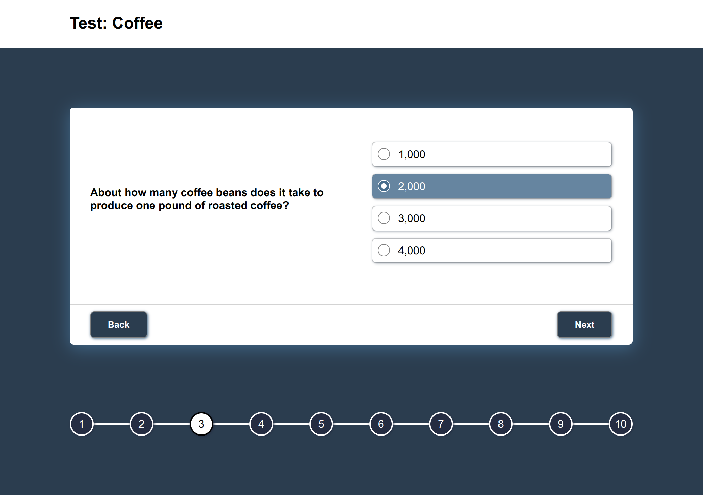
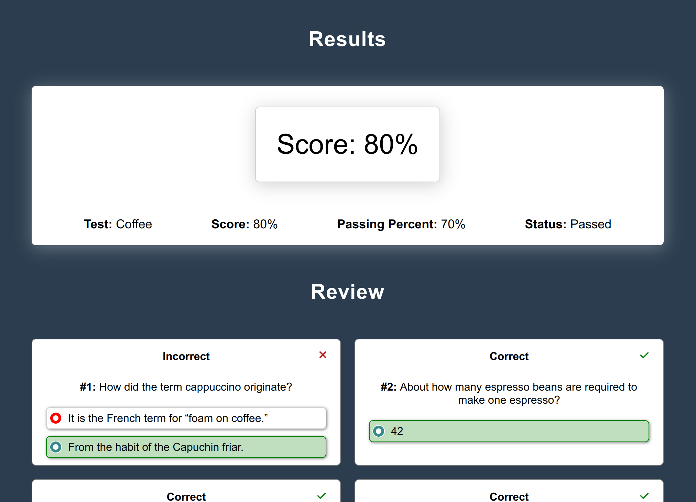

# coderbyte test

A functioning test taking website. This project is a monorepo composed of two packages, an API built with Express, and a frontend Client built with React.

## Getting Started

1. Clone the repo
2. `yarn && yarn start`
3. Happy testing!

## Stack

### API

- `express-generator`
- `express`
- `cors`
- `uuid`

### Client

- `react`
- `typescript`
- `styled-components`

## Screenshots

### quiz

### results page

